# Yahoo Fantasy Basketball Database Schema

## 概述

这是一个专为Yahoo Fantasy篮球联盟设计的数据仓库schema，采用星型模式设计，支持球员统计、团队表现、交易记录和阵容管理等核心功能。

## 数据库架构图

```mermaid
erDiagram
    %% 维度表
    Game {
        string game_key PK
        string game_id
        string name
        string code
        string type
        string season
        boolean is_registration_over
        boolean is_game_over
        boolean is_offseason
        datetime created_at
        datetime updated_at
    }
    
    League {
        string league_key PK
        string league_id
        string game_key FK
        string name
        string url
        string draft_status
        integer num_teams
        string scoring_type
        string league_type
        string current_week
        string start_date
        string end_date
        boolean is_finished
        string season
        datetime created_at
        datetime updated_at
    }
    
    Team {
        string team_key PK
        string team_id
        string league_key FK
        string name
        string url
        string team_logo_url
        integer waiver_priority
        integer number_of_moves
        integer number_of_trades
        boolean clinched_playoffs
        datetime created_at
        datetime updated_at
    }
    
    Player {
        string player_key PK
        string player_id
        string editorial_player_key
        string league_key FK
        string full_name
        string first_name
        string last_name
        string current_team_key
        string display_position
        string primary_position
        string status
        string season
        datetime created_at
        datetime updated_at
    }
    
    DateDimension {
        integer id PK
        date date
        string league_key FK
        string season
    }
    
    StatCategory {
        integer id PK
        string league_key FK
        integer stat_id
        string name
        string display_name
        string abbr
        boolean is_core_stat
        string core_stat_column
        datetime created_at
        datetime updated_at
    }
    
    %% 配置表
    LeagueSettings {
        integer id PK
        string league_key FK
        string draft_type
        boolean is_auction_draft
        boolean uses_playoff
        integer num_playoff_teams
        string waiver_type
        json roster_positions
        datetime created_at
        datetime updated_at
    }
    
    LeagueRosterPosition {
        integer id PK
        string league_key FK
        string position
        string position_type
        integer count
        boolean is_starting_position
        datetime created_at
        datetime updated_at
    }
    
    Manager {
        integer id PK
        string manager_id
        string team_key FK
        string nickname
        string guid
        boolean is_commissioner
        string email
        datetime created_at
        datetime updated_at
    }
    
    %% 关联表
    PlayerEligiblePosition {
        integer id PK
        string player_key FK
        string position
        datetime created_at
    }
    
    TransactionPlayer {
        integer id PK
        string transaction_key FK
        string player_key
        string player_name
        string transaction_type
        string source_type
        string source_team_key
        string destination_type
        string destination_team_key
        datetime created_at
        datetime updated_at
    }
    
    %% 事实表
    PlayerDailyStats {
        integer id PK
        string player_key
        string editorial_player_key
        string league_key FK
        string season
        date date
        integer week
        integer field_goals_made
        integer field_goals_attempted
        decimal field_goal_percentage
        integer free_throws_made
        integer free_throws_attempted
        decimal free_throw_percentage
        integer three_pointers_made
        integer points
        integer rebounds
        integer assists
        integer steals
        integer blocks
        integer turnovers
        datetime fetched_at
        datetime updated_at
    }
    
    PlayerSeasonStats {
        integer id PK
        string player_key
        string editorial_player_key
        string league_key FK
        string season
        integer field_goals_made
        integer field_goals_attempted
        decimal field_goal_percentage
        integer free_throws_made
        integer free_throws_attempted
        decimal free_throw_percentage
        integer three_pointers_made
        integer total_points
        integer total_rebounds
        integer total_assists
        integer total_steals
        integer total_blocks
        integer total_turnovers
        integer games_played
        float avg_points
        datetime fetched_at
        datetime updated_at
    }
    
    TeamStatsWeekly {
        integer id PK
        string team_key FK
        string league_key FK
        string season
        integer week
        integer field_goals_made
        integer field_goals_attempted
        decimal field_goal_percentage
        integer free_throws_made
        integer free_throws_attempted
        decimal free_throw_percentage
        integer three_pointers_made
        integer points
        integer rebounds
        integer assists
        integer steals
        integer blocks
        integer turnovers
        datetime fetched_at
        datetime updated_at
    }
    
    RosterDaily {
        integer id PK
        string team_key FK
        string player_key FK
        string league_key FK
        date date
        string season
        integer week
        string selected_position
        boolean is_starting
        boolean is_bench
        boolean is_injured_reserve
        string player_status
        string status_full
        string injury_note
        boolean is_keeper
        string keeper_cost
        boolean is_prescoring
        boolean is_editable
        datetime fetched_at
        datetime updated_at
    }
    
    Transaction {
        string transaction_key PK
        string transaction_id
        string league_key FK
        string type
        string status
        string timestamp
        string trader_team_key
        string trader_team_name
        string tradee_team_key
        string tradee_team_name
        json picks_data
        json players_data
        datetime created_at
        datetime updated_at
    }
    
    LeagueStandings {
        integer id PK
        string league_key FK
        string team_key FK
        string season
        integer rank
        string playoff_seed
        integer wins
        integer losses
        integer ties
        float win_percentage
        string games_back
        integer divisional_wins
        integer divisional_losses
        integer divisional_ties
        datetime fetched_at
        datetime updated_at
    }
    
    TeamMatchups {
        integer id PK
        string league_key FK
        string team_key FK
        string season
        integer week
        string week_start
        string week_end
        string status
        string opponent_team_key FK
        boolean is_winner
        boolean is_tied
        integer team_points
        integer opponent_points
        string winner_team_key
        boolean is_playoffs
        boolean is_consolation
        boolean is_matchup_of_week
        boolean wins_field_goal_pct
        boolean wins_free_throw_pct
        boolean wins_three_pointers
        boolean wins_points
        boolean wins_rebounds
        boolean wins_assists
        boolean wins_steals
        boolean wins_blocks
        boolean wins_turnovers
        integer completed_games
        integer remaining_games
        integer live_games
        integer opponent_completed_games
        integer opponent_remaining_games
        integer opponent_live_games
        datetime fetched_at
        datetime updated_at
    }
    
    %% 关系定义
    Game ||--o{ League : contains
    League ||--o{ Team : has
    League ||--o{ Player : contains
    League ||--o{ DateDimension : spans
    League ||--o{ StatCategory : defines
    League ||--|| LeagueSettings : configured_by
    League ||--o{ LeagueRosterPosition : has_positions
    League ||--o{ Transaction : contains
    League ||--o{ PlayerDailyStats : tracks
    League ||--o{ PlayerSeasonStats : summarizes
    League ||--o{ TeamStatsWeekly : aggregates
    League ||--o{ RosterDaily : manages
    League ||--o{ LeagueStandings : ranks
    League ||--o{ TeamMatchups : schedules
    
    Team ||--o{ Manager : managed_by
    Team ||--o{ RosterDaily : owns
    Team ||--o{ TeamStatsWeekly : performs
    Team ||--o{ LeagueStandings : ranked_in
    Team ||--o{ TeamMatchups : participates_in
    
    Player ||--o{ PlayerEligiblePosition : eligible_for
    Player ||--o{ RosterDaily : assigned_to
    
    Transaction ||--o{ TransactionPlayer : involves
```

## 表分类

### 🔹 维度表 (Dimension Tables)

#### 1. Game
**用途**: 存储Yahoo Fantasy游戏的基本信息
- **主键**: `game_key`
- **核心字段**: `code` (NBA), `season`, `type`
- **索引**: `idx_game_code_season`

#### 2. League
**用途**: Fantasy联盟的核心维度表
- **主键**: `league_key`
- **外键**: `game_key` → Game
- **核心字段**: `name`, `season`, `num_teams`, `scoring_type`
- **索引**: `idx_league_game_season`, `idx_league_status`

#### 3. Team
**用途**: 联盟中的Fantasy团队
- **主键**: `team_key`
- **外键**: `league_key` → League
- **核心字段**: `name`, `waiver_priority`, `number_of_moves`
- **索引**: `idx_team_league`

#### 4. Player
**用途**: NBA球员信息维度
- **主键**: `player_key`
- **外键**: `league_key` → League
- **核心字段**: `full_name`, `display_position`, `current_team_key`
- **索引**: `idx_player_league`, `idx_player_name`, `idx_player_position`

#### 5. DateDimension
**用途**: 时间维度表，管理赛季日程
- **主键**: `id`
- **外键**: `league_key` → League
- **核心字段**: `date`, `season`
- **索引**: `idx_date_unique`, `idx_date_season`

#### 6. StatCategory
**用途**: 统计类别定义
- **主键**: `id`
- **外键**: `league_key` → League
- **核心字段**: `stat_id`, `name`, `abbr`, `is_core_stat`
- **索引**: `idx_stat_category_unique`, `idx_stat_category_core`

### 🔸 配置表 (Configuration Tables)

#### 7. LeagueSettings
**用途**: 联盟规则和设置配置
- **主键**: `id`
- **外键**: `league_key` → League (1:1关系)
- **核心字段**: `draft_type`, `uses_playoff`, `waiver_type`

#### 8. LeagueRosterPosition
**用途**: 联盟阵容位置配置
- **主键**: `id`
- **外键**: `league_key` → League
- **核心字段**: `position`, `count`, `is_starting_position`

#### 9. Manager
**用途**: 团队管理员信息
- **主键**: `id`
- **外键**: `team_key` → Team
- **核心字段**: `nickname`, `is_commissioner`

### 🔗 关联表 (Bridge Tables)

#### 10. PlayerEligiblePosition
**用途**: 球员可打位置的多对多关联
- **主键**: `id`
- **外键**: `player_key` → Player
- **核心字段**: `position`
- **索引**: `idx_player_position_unique`

#### 11. TransactionPlayer
**用途**: 交易涉及球员的详细信息
- **主键**: `id`
- **外键**: `transaction_key` → Transaction
- **核心字段**: `player_key`, `transaction_type`, `source_team_key`

### 📊 事实表 (Fact Tables)

#### 12. PlayerDailyStats
**用途**: 球员每日统计数据事实表
- **主键**: `id`
- **外键**: `league_key` → League
- **粒度**: 球员 × 日期
- **度量**: 11个核心篮球统计项（投篮、得分、篮板等）
- **索引**: `idx_player_daily_unique`, `idx_player_daily_league_date`

#### 13. PlayerSeasonStats
**用途**: 球员赛季累计统计事实表
- **主键**: `id`
- **外键**: `league_key` → League
- **粒度**: 球员 × 赛季
- **度量**: 11个核心统计项 + 派生指标（场均得分等）
- **索引**: `idx_player_season_unique`, `idx_player_season_points`

#### 14. TeamStatsWeekly
**用途**: 团队周统计事实表
- **主键**: `id`
- **外键**: `team_key` → Team, `league_key` → League
- **粒度**: 团队 × 周
- **度量**: 11个团队统计项
- **索引**: `idx_team_stat_weekly_unique`

#### 15. RosterDaily
**用途**: 每日阵容分配事实表
- **主键**: `id`
- **外键**: `team_key` → Team, `player_key` → Player, `league_key` → League
- **粒度**: 团队 × 球员 × 日期
- **度量**: 位置信息、首发状态、伤病状态
- **索引**: `idx_roster_daily_unique`, `idx_roster_daily_team_date`

#### 16. Transaction
**用途**: 交易记录事实表
- **主键**: `transaction_key`
- **外键**: `league_key` → League
- **粒度**: 每个交易
- **度量**: 交易类型、时间戳、涉及团队
- **索引**: `idx_transaction_league`, `idx_transaction_type`

#### 17. LeagueStandings
**用途**: 联盟排名事实表
- **主键**: `id`
- **外键**: `league_key` → League, `team_key` → Team
- **粒度**: 团队 × 赛季
- **度量**: 排名、胜负记录、胜率
- **索引**: `idx_league_standings_unique`, `idx_league_standings_rank`

#### 18. TeamMatchups
**用途**: 团队对战事实表
- **主键**: `id`
- **外键**: `league_key` → League, `team_key` → Team, `opponent_team_key` → Team
- **粒度**: 团队 × 对战周
- **度量**: 对战结果、各统计类别获胜情况、比赛场次
- **索引**: `idx_team_matchup_unique`, `idx_team_matchup_league`

## 核心统计项定义

所有统计事实表都包含以下11个标准化的篮球统计项：

1. **field_goals_made/attempted** - 投篮命中/尝试
2. **field_goal_percentage** - 投篮命中率
3. **free_throws_made/attempted** - 罚球命中/尝试  
4. **free_throw_percentage** - 罚球命中率
5. **three_pointers_made** - 三分球命中
6. **points** - 得分
7. **rebounds** - 篮板
8. **assists** - 助攻
9. **steals** - 抢断
10. **blocks** - 盖帽
11. **turnovers** - 失误

## 数据完整性约束

### 外键约束
- 所有事实表都通过 `league_key` 关联到 League 表
- 球员相关表通过 `player_key` 关联到 Player 表
- 团队相关表通过 `team_key` 关联到 Team 表

### 唯一性约束
- `PlayerDailyStats`: (player_key, date) 唯一
- `PlayerSeasonStats`: (player_key, season) 唯一
- `TeamStatsWeekly`: (team_key, season, week) 唯一
- `RosterDaily`: (team_key, player_key, date) 唯一

### 索引策略
- **查询优化**: 针对常见查询模式创建复合索引
- **时间范围查询**: 为所有时间相关查询创建日期索引
- **统计排序**: 为核心统计项创建排序索引

