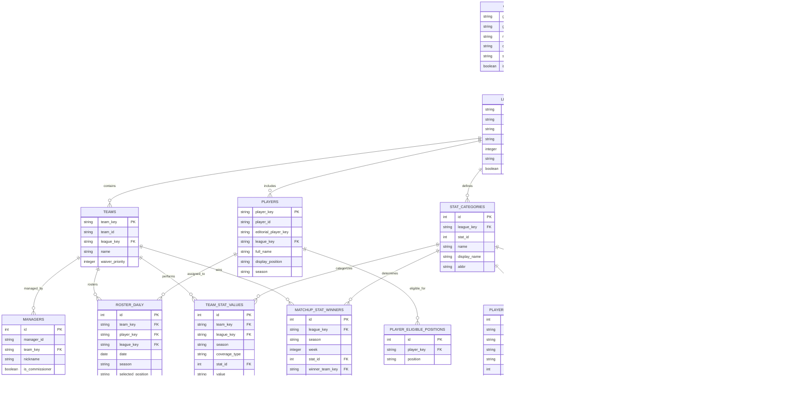
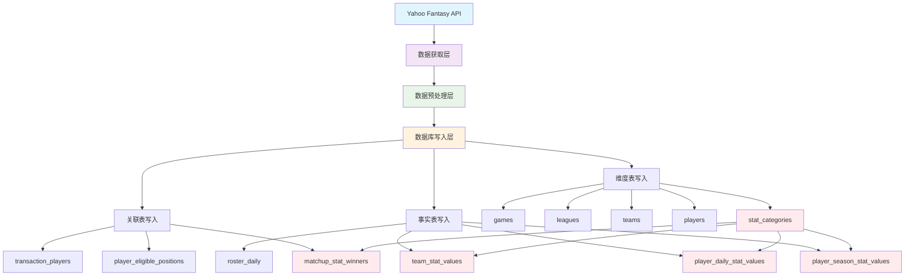

# Yahoo Fantasy Sports 数据库架构文档

## 概述

本文档描述了 Yahoo Fantasy Sports 数据收集系统的数据库架构。该系统采用 PostgreSQL 数据库，使用 SQLAlchemy ORM 框架，实现了标准化的关系型数据库设计，优化了数据完整性和查询性能。

## 设计理念

### 核心原则
1. **数据规范化**: 消除冗余，确保数据一致性
2. **数据完整性**: 通过外键约束保证引用完整性
3. **查询优化**: 合理索引和表结构设计
4. **扩展性**: 支持多联盟、多赛季的灵活扩展

### 架构特点
- **Star Schema**: 以事实表为中心的星型架构，便于 OLAP 查询
- **标准化统计**: 统一的统计值存储格式，支持灵活的统计分析
- **时间维度**: 完整的时间维度支持，从日期到赛季的多级时间粒度
- **外键约束**: 严格的数据完整性约束，确保数据一致性

## 表分类总览

### 🔹 维度表 (Dimension Tables) - 7张
- `games` - 游戏基本信息
- `leagues` - 联盟信息  
- `teams` - 团队信息
- `players` - 球员信息
- `managers` - 管理员信息
- `date_dimension` - 日期维度
- `stat_categories` - 统计类别定义

### 🔸 事实表 (Fact Tables) - 4张
- `player_season_stat_values` - 球员赛季统计值
- `player_daily_stat_values` - 球员日期统计值
- `team_stat_values` - 团队统计值
- `roster_daily` - 每日名单记录

### 🔗 关联表 (Junction Tables) - 3张
- `player_eligible_positions` - 球员合适位置
- `matchup_stat_winners` - 比赛统计获胜者
- `transaction_players` - 交易球员详情

### ⚙️ 配置表 (Configuration Tables) - 2张
- `league_settings` - 联盟设置
- `transactions` - 交易记录

**总计：16张表**

## 数据库架构设计优化

### ✅ 已实施的优化
1. **移除统计定义冗余**：从统计值表中移除 `stat_name`、`stat_display_name`、`stat_abbr` 字段
2. **删除冗余表**：移除 `team_stats` 表，其功能由 `team_stat_values` 表承担
3. **添加外键约束**：为所有 `stat_id` 字段添加外键约束到 `stat_categories` 表
4. **强化数据完整性**：增加更多外键约束确保引用完整性

## 实体关系图 (ER Diagram)



## 关键设计特性

### 1. 外键约束体系
```sql
-- 统计值表的外键约束
ALTER TABLE player_season_stat_values 
ADD CONSTRAINT fk_stat_category 
FOREIGN KEY (stat_id) REFERENCES stat_categories(stat_id);

ALTER TABLE player_daily_stat_values 
ADD CONSTRAINT fk_stat_category 
FOREIGN KEY (stat_id) REFERENCES stat_categories(stat_id);

ALTER TABLE team_stat_values 
ADD CONSTRAINT fk_stat_category 
FOREIGN KEY (stat_id) REFERENCES stat_categories(stat_id);

ALTER TABLE matchup_stat_winners 
ADD CONSTRAINT fk_stat_category 
FOREIGN KEY (stat_id) REFERENCES stat_categories(stat_id);
```

### 2. 统计数据标准化
**优化前**：
```sql
-- 冗余存储统计定义
CREATE TABLE player_season_stat_values (
    -- ... 其他字段
    stat_id INTEGER NOT NULL,
    stat_name VARCHAR(200),      -- 冗余字段
    stat_display_name VARCHAR(100), -- 冗余字段
    stat_abbr VARCHAR(20)        -- 冗余字段
);
```

**优化后**：
```sql
-- 标准化存储，通过JOIN获取统计定义
CREATE TABLE player_season_stat_values (
    -- ... 其他字段
    stat_id INTEGER NOT NULL REFERENCES stat_categories(stat_id)
    -- 移除冗余字段，通过JOIN获取统计定义
);
```

### 3. 查询优化示例
**获取球员赛季统计（带统计定义）**：
```sql
SELECT 
    p.full_name,
    sc.display_name,
    sc.abbr,
    psv.value,
    psv.season
FROM player_season_stat_values psv
JOIN players p ON psv.player_key = p.player_key
JOIN stat_categories sc ON psv.stat_id = sc.stat_id 
    AND psv.league_key = sc.league_key
WHERE psv.league_key = 'nba.l.123456'
    AND psv.season = '2024'
ORDER BY p.full_name, sc.sort_order;
```

## 数据流程图



## 性能优化索引

### 1. 唯一索引
```sql
-- 防止重复数据
CREATE UNIQUE INDEX idx_player_season_stat_unique 
ON player_season_stat_values(player_key, season, stat_id);

CREATE UNIQUE INDEX idx_player_daily_stat_unique 
ON player_daily_stat_values(player_key, date, stat_id);

CREATE UNIQUE INDEX idx_team_stat_unique 
ON team_stat_values(team_key, coverage_type, season, week, date, stat_id);
```

### 2. 复合索引
```sql
-- 支持常用查询模式
CREATE INDEX idx_player_season_stat_league 
ON player_season_stat_values(league_key, season);

CREATE INDEX idx_player_daily_stat_league_date 
ON player_daily_stat_values(league_key, date);

CREATE INDEX idx_team_stat_league_time 
ON team_stat_values(league_key, coverage_type, season);
```

### 3. 外键索引
```sql
-- 支持JOIN查询
CREATE INDEX idx_player_season_stat_stat 
ON player_season_stat_values(stat_id, season);

CREATE INDEX idx_player_daily_stat_stat_date 
ON player_daily_stat_values(stat_id, date);

CREATE INDEX idx_team_stat_stat_time 
ON team_stat_values(stat_id, coverage_type, season);
```

## 数据完整性保证

### 1. 外键约束
- 所有统计值表的 `stat_id` 字段都有外键约束
- 所有 `league_key` 字段都引用 `leagues` 表
- 所有 `team_key` 字段都引用 `teams` 表
- 所有 `player_key` 字段都引用 `players` 表

### 2. 唯一约束
- 防止重复的统计记录
- 确保关联关系的唯一性
- 避免数据冗余

### 3. 非空约束
- 关键字段的非空限制
- 确保数据的完整性

## 设计优势

### 1. Star Schema 架构
- **查询性能**: 优化了复杂分析查询的性能
- **易于理解**: 清晰的事实表和维度表分离
- **可扩展性**: 易于添加新的维度和事实

### 2. 标准化统计存储
- **消除冗余**: 移除统计定义字段，通过JOIN获取
- **数据一致性**: 统计定义的单一数据源
- **存储效率**: 减少存储空间需求

### 3. 完整的时间维度
- **历史分析**: 支持完整的历史数据分析
- **时间序列**: 便于进行时间序列分析
- **多粒度**: 支持不同时间粒度的数据聚合

### 4. 数据完整性
- **外键约束**: 严格的引用完整性保证
- **唯一约束**: 防止重复数据
- **级联操作**: 适当的级联删除和更新

## 查询性能考虑

### 1. JOIN查询优化
```sql
-- 优化后的查询模式，利用外键约束和索引
SELECT 
    p.full_name,
    sc.display_name,
    psv.value
FROM player_season_stat_values psv
JOIN players p ON psv.player_key = p.player_key
JOIN stat_categories sc ON psv.stat_id = sc.stat_id 
    AND psv.league_key = sc.league_key
WHERE psv.league_key = ? AND psv.season = ?;
```

### 2. 索引使用策略
- 根据查询模式设计复合索引
- 利用外键索引提高JOIN性能
- 定期分析查询执行计划

### 3. 查询优化建议
- 使用适当的WHERE条件过滤
- 避免SELECT *，只选择需要的列
- 利用统计信息优化查询计划

## 局限性和改进方向

### 1. 当前局限性
- **JOIN开销**: 统计值查询需要额外的JOIN操作
- **查询复杂度**: 获取统计定义需要更复杂的查询
- **性能权衡**: 减少存储冗余但增加查询复杂度

### 2. 改进方向
- **物化视图**: 为常用查询创建物化视图
- **查询缓存**: 实现应用层查询缓存
- **索引优化**: 根据实际查询模式优化索引
- **分区策略**: 考虑按时间分区大表

### 3. 扩展可能性
- **读写分离**: 实现读写分离架构
- **数据压缩**: 使用更好的数据压缩策略
- **实时分析**: 集成实时分析能力
- **多租户**: 支持多租户架构

## 维护和监控

### 1. 数据质量监控
```sql
-- 检查外键约束违反
SELECT COUNT(*) FROM player_season_stat_values psv
LEFT JOIN stat_categories sc ON psv.stat_id = sc.stat_id 
    AND psv.league_key = sc.league_key
WHERE sc.stat_id IS NULL;
```

### 2. 性能监控
- 定期检查查询执行计划
- 监控JOIN操作的性能
- 分析索引使用情况

### 3. 数据一致性检查
- 验证外键约束的完整性
- 检查统计数据的逻辑一致性
- 监控数据更新的及时性

## 总结

本次数据库优化通过以下关键改进实现了更好的数据完整性和规范化：

1. **消除数据冗余**: 移除统计值表中的冗余统计定义字段
2. **强化外键约束**: 添加完整的外键约束体系
3. **简化表结构**: 删除冗余的team_stats表
4. **优化查询模式**: 通过JOIN获取统计定义信息

这些优化在确保数据完整性的同时，提供了更灵活和可扩展的数据库架构，为复杂的Fantasy Sports数据分析奠定了坚实的基础。 